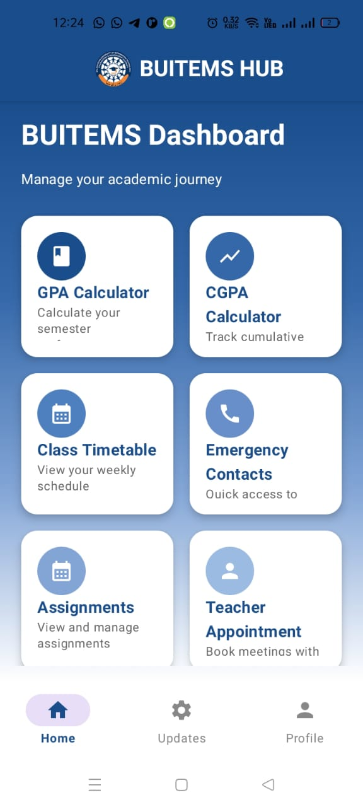
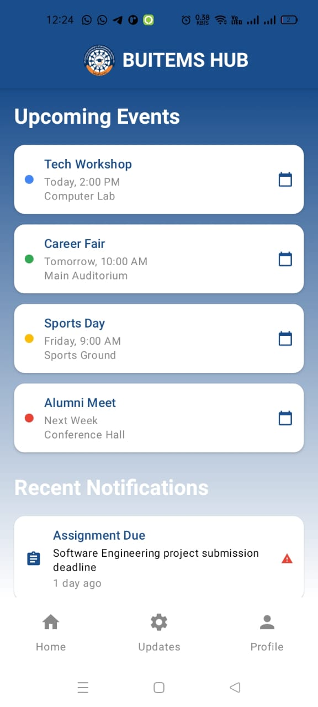
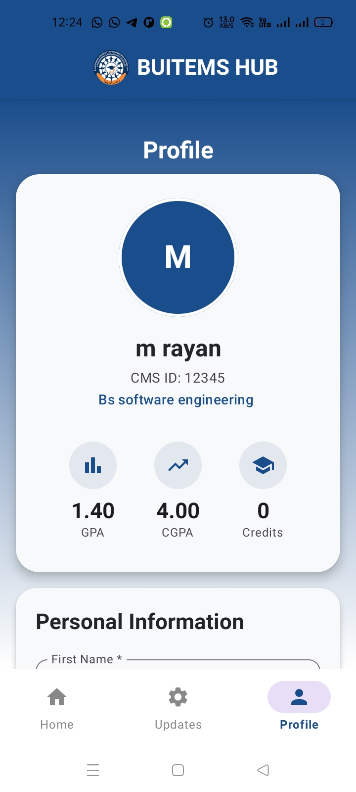
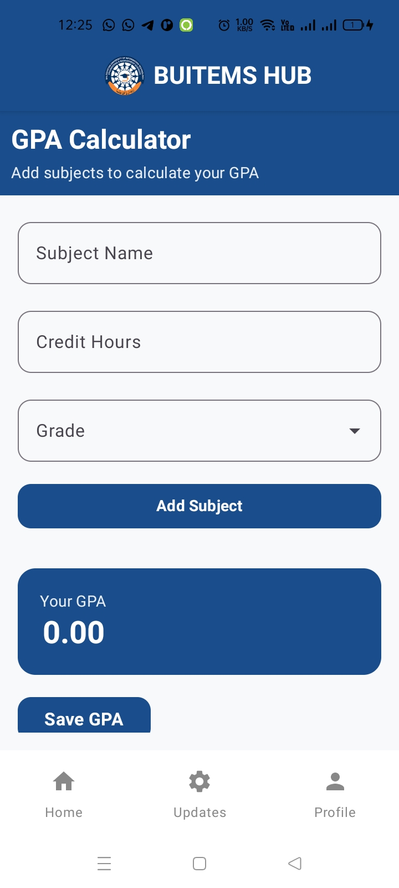
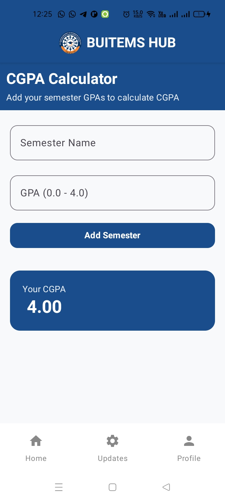
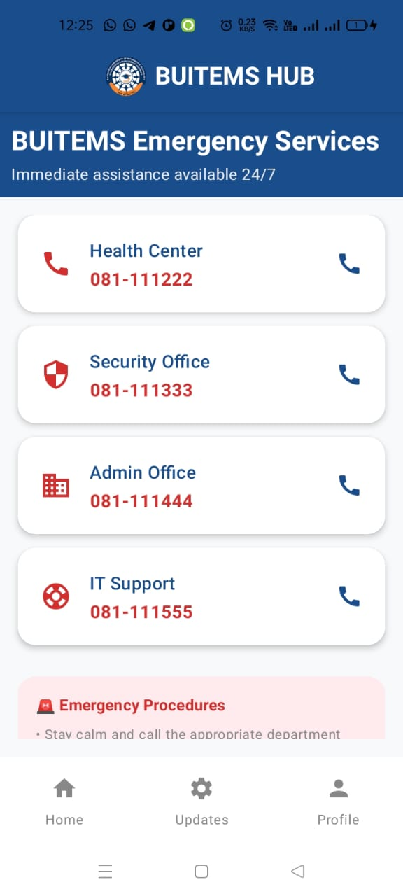
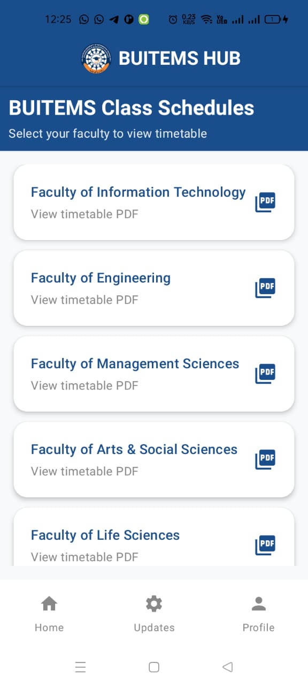
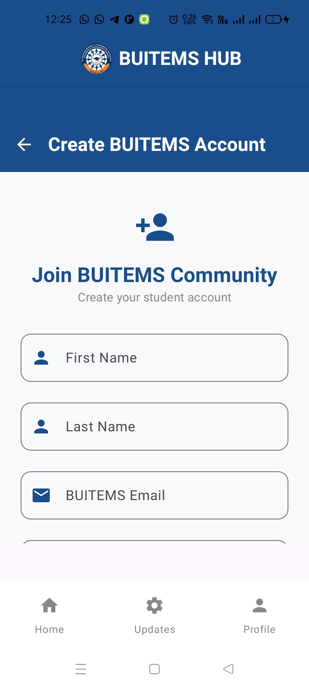
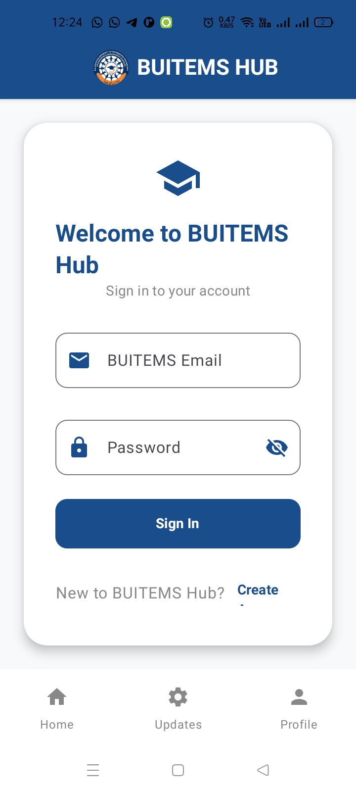

# 🎓 Unis Hub

Unis Hub is an **all-in-one student companion app** built with **Jetpack Compose (Android)**.  
It helps university students manage their academic life by providing GPA/CGPA calculators, timetables, emergency contacts, event notifications, and a personalized profile system.

---

## 🚀 Features
- 📊 **GPA & CGPA Calculator**  
  - Add subjects, credit hours, and grades  
  - Auto calculate GPA & CGPA  
  - Save your results locally  

- 📅 **Timetables**  
  - Add and view class schedules  
  - Reminders for upcoming classes  

- ☎️ **Emergency Numbers**  
  - Quick access to university emergency contacts  
  - One-tap call support  

- 🔔 **Events & Notifications**  
  - Get notified about university events and updates  
  - Event calendar integration  

- 👤 **Profile (Login & Signup)**  
  - Firebase Authentication (email, Google login)  
  - Profile page with student details  

---

## 🛠️ Tech Stack
- **Kotlin** (Jetpack Compose)
- **Material 3 (M3)** for UI
- **Room Database** (local data storage)
- **Firebase Auth & Firestore** (user accounts & events)
- **Firebase Cloud Messaging** (notifications)
---

## 📱 Screens (Planned)
- Splash Screen  
- Login / Signup  
- Home Dashboard  
- GPA & CGPA Calculator  
- Timetable Manager  
- Emergency Contacts  
- Events & Notifications  
- Profile Page  

---

## 🎨 Design
- Gradient background (`Dark Blue → Mid Blue → Light Blue → White`)  
- Rounded cards for sections  
- Bottom Navigation Bar for quick access  

---

## 📷 Screenshots

Here are some previews of **Unis Hub** in action:
 

---
## 🔮 Future Improvements
- Dark mode theme  
- Cloud sync across devices  
- AI-powered study assistant  
- Offline timetable reminders  

---

## 🤝 Contributing
Pull requests are welcome! For major changes, please open an issue first to discuss what you would like to change.  

---

## 📜 License
This project is licensed under the **MIT License** – feel free to use and modify it.  

## 📬 Contact
If you face any **errors**, have suggestions, or use this project in your own work – feel free to **contact me**.
- muhammdrayan182@gmail.com

